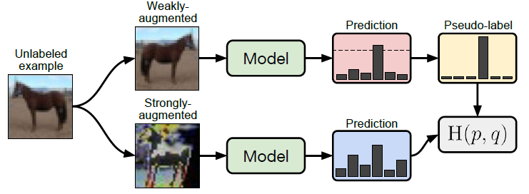

# Semi-Supervised Learning for WBM Classification (SSL-WBMC)

## Purpose

This project extends the previous supervised wafer defect classification study
to a **Semi-Supervised Learning setting** using both labeled and unlabeled WM-811K data.

The goal is to explore whether large-scale unlabeled wafer maps can be effectively utilized
for 9-class wafer defect classification.

---

## Workflow



---

## Key Contributions

- **FixMatch-style Semi-Supervised Learning**
  using weak/strong augmentation and confidence-based pseudo labeling.

- **Wafer-aware Strong Augmentation**
  with Cutout and Masked Bernoulli Noise to perturb wafer regions while preserving the background.

- **Confidence-based Pseudo Label Filtering**
  using a threshold of `0.90` to reduce the influence of unreliable pseudo labels.

- **Adaptive Loss Weighting**
  to dynamically balance supervised and unsupervised objectives during training.

- **Large-scale Unlabeled Data Utilization**
  using approximately `638K` unlabeled wafer maps in addition to labeled WM-811K data.

---

## Key Results
- **Validation Accuracy**: `0.9787`
- **Validation Macro-F1**: `0.8974`
- **Test Accuracy**: `0.9789`
- **Test Macro-F1**: `0.8984`

---

## Limitation & Future Work

Pseudo labels were heavily concentrated on the dominant `None` class,
indicating that the severe class imbalance in WM-811K also affects pseudo-label generation.

Future work includes:

- Applying **AdaSH: Adaptive Thresholding** to reduce dominant-class pseudo-label bias.
- Evaluating class-wise pseudo-label distributions and acceptance rates.
- Quantitatively evaluating the actual contribution of unlabeled wafer maps.

---

## Directory Structure

```text
SSL_WBMC/
      ├── data/
      │
      ├── dataset/
      │   └── dataset.py                   # Dataset loading and augmentation logic
      │
      ├── model/
      │   └── model.py                     # ResNet model
      │
      ├── utils/
      │   ├── trainer_MTL.py               # FixMatch / multi-task learning trainer
      │   ├── trainer_adsh.py              # AdaSH trainer
      │   └── utils.py                     
      │
      ├── figures/
      │   ├── fixmatch.png                 
      │   ├── pseudo_label_distribution.png
      │   └── Strong_Augmentation.png      
      │
      ├── checkpoints/                     
      │
      ├── log/                             
      │   ├── adsh/
      │   └── hyperparameter_tuning/Multi_task_learning
      │
      ├── main_MTL.py                      # Main FixMatch + MTL training script
      ├── main_adsh.py                     # Main AdaSH training script
      └── README.md
```

